# 🚖 RealCabs: Transportation Performance Analysis

##  Company Overview

RealCabs, an imaginary company established two years ago, has quickly become a leading cab service provider in India's tier-II cities. Unlike traditional competitors, RealCabs is driven by a mission to empower local drivers, helping them build sustainable livelihoods within their communities while providing passengers with exceptional service. Operating across 10 tier-II cities, RealCabs combines a community-focused approach with a commitment to delivering a seamless travel experience. It aims to solidify its position as a trusted mobility partner in underserved markets.

## 🔎 Problem Statement

RealCabs has been operating in tier-II cities for two years, but it is still far from reaching its market penetration goals. Despite establishing a solid presence in these areas, the company is struggling to meet its ambitious 2024 targets.  
To overcome this challenge, RealCabs needs an in-depth analysis of key performance metrics. This analysis will help identify critical growth opportunities and resolve operational inefficiencies that are hindering progress.

## 🎯 Project Objective

The objective of this project is to conduct a comprehensive analysis of RealCabs' performance across key metrics—such as trip volume, passenger satisfaction, retention rates, trip distribution, and the balance between new and repeat passengers. By evaluating these metrics, the project aims to identify critical growth opportunities, address operational inefficiencies, and provide actionable insights to help Goodcabs achieve its market penetration goals and meet its ambitious targets for 2024.  
The insights from this analysis will support strategic decision-making and drive the company’s growth in tier-2 cities.

## 🛢 Data Overview

Eight csv tables containing raw data containing fact tables (fact_trips, fact_passenger_summary) and dimension tables (dim_date, dim_city, dim_repeat_trip_distribution) & targets_db: Contains city- and month-specific target tables (monthly_target_trips, monthly_target_new_passengers, city_target_passenger_rating).

The dataset spans from January 1, 2024, to June 30, 2024.

## 🛠️ Tools

- Data Visualization: Excel Charts & Graphs
- Data Analysis: PowerPivot, DAX, Pivot Tables
- Data Loading & Transformation: Power Query

## 🧹️ Data Cleaning & Transformation:

- Used Power Query to clean and transform raw data.  
- Removed duplicates and unnecessary columns.  
- Applied the TRIM function to eliminate leading and trailing spaces.  
- Added conditional columns where necessary.  
- Created a dim_month table with unique months and their start dates.  
- Generated two additional tables in Power Query for filtering purposes:  
  - City_Average_rating: Contains average city wise rating.  
  - Set BM: Includes two columns—Benchmarks (vs Previous month/vs Target) and IDs.
 
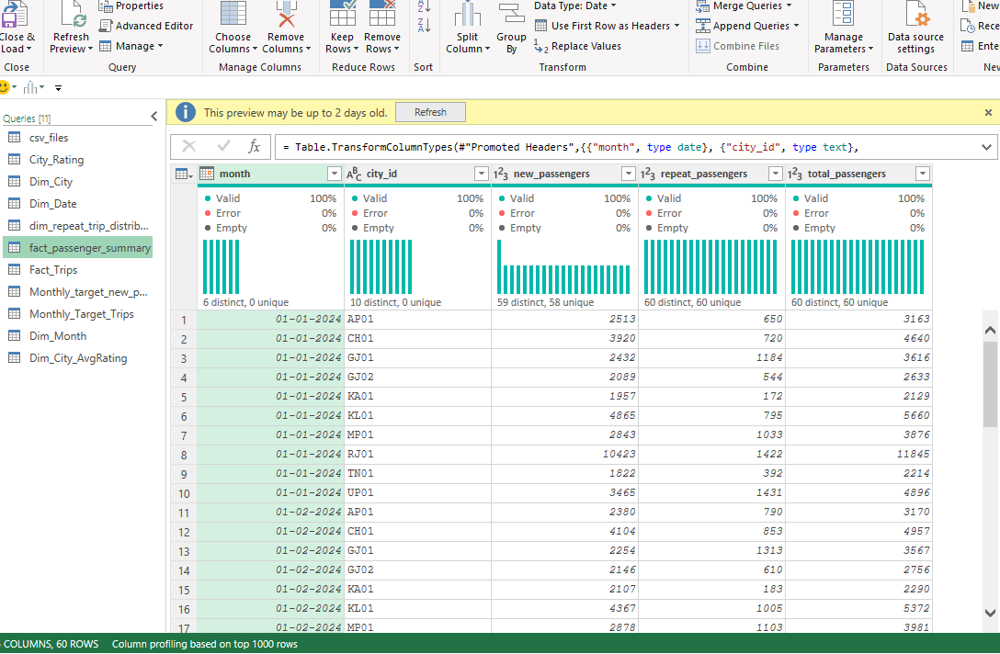
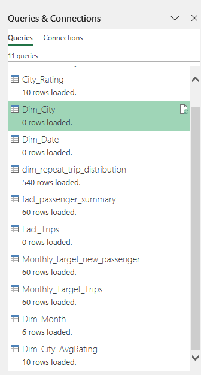

### Power Pivot, DAX & Data Modelling  

 - After meeting the criteria for each and every tables now all the data is loaded into Power Pivot.
 - Around 50+ medium to Advanced level DAX has been created to meet the desired results like examples: Previous Month Sales, New vs Repeated Passengers Ratio etc.
 - Data Modelling/Relationship achieve forming Star Schema.

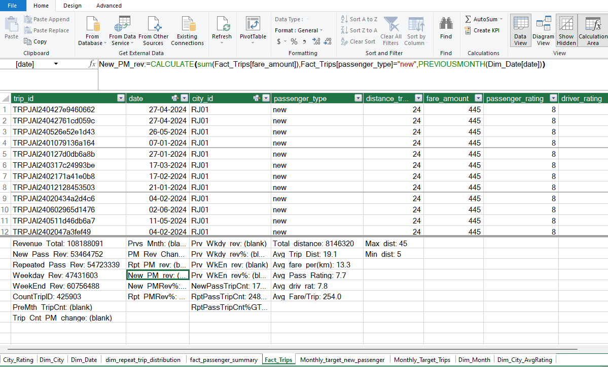
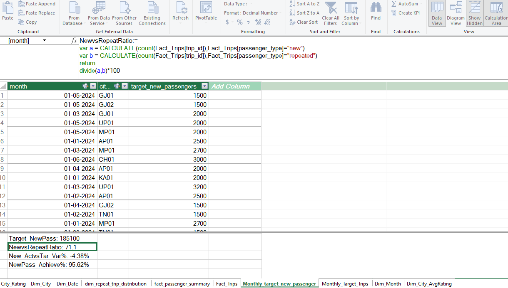
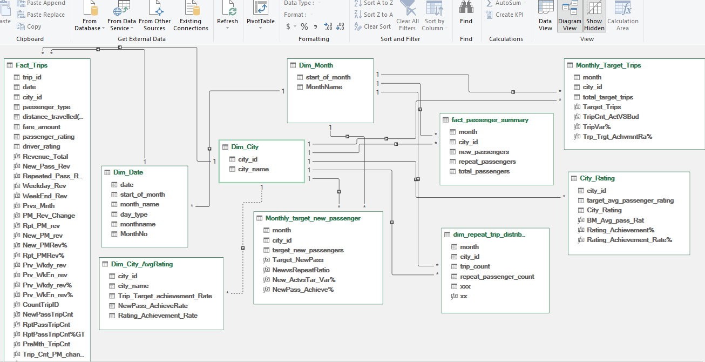

### Excel Dashboard
 - Total 6 sheets workbook of which:
    - 1 sheet for entire 35+ pivots created for building charts for dashboard.
    - 5 Page dashboards created naming: Sales, Finance, Operation, Marketing & Executives
  
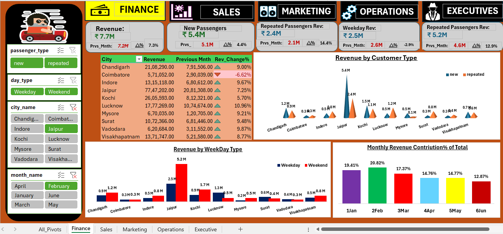
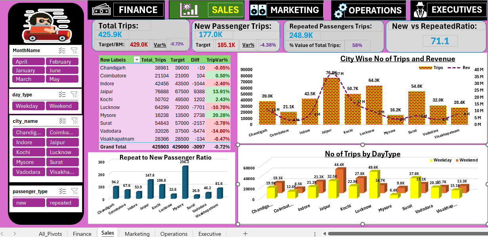
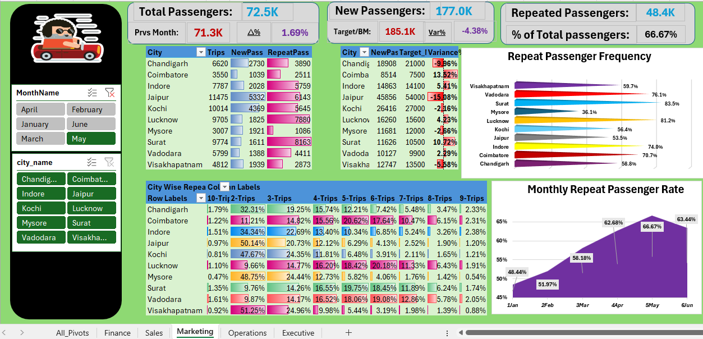
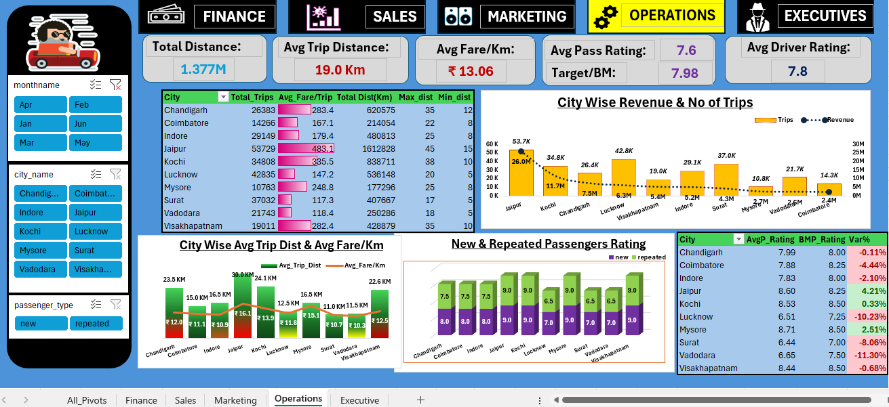
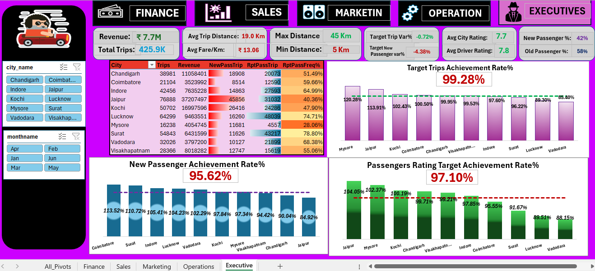
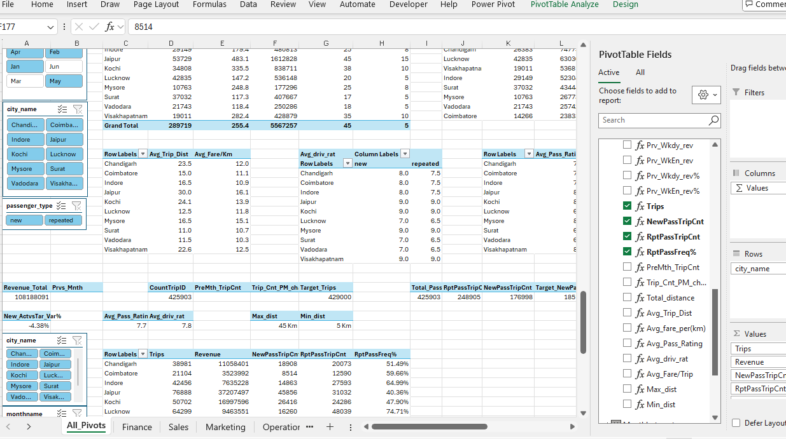

## 💡 Insights

#### Top Cities by Revenue Contribution:

- Jaipur (₹37.21M), Kochi (₹17.00M), and Chandigarh (₹11.06M) are the top 3 cities by revenue contribution.

#### Bottom Cities by Revenue Contribution:

- Mysore (₹4.05M), Vadodara (₹3.80M), and Coimbatore (₹3.52M) are the bottom 3 cities by revenue contribution.

#### Monthly Revenue Contribution:

- February (18.36%) contributes the most to revenue.
- June (14.19%) contributes the least to revenue.

#### Top Cities by Trip Volume:

- Jaipur (18.05%), Lucknow (15.10%), and Surat (12.88%) are the top 3 cities by trip volume.

#### Bottom Cities by Trip Volume:

- Visakhapatnam (6.66%), Coimbatore (4.96%), and Mysore (3.81%) are the bottom 3 cities by trip volume.

#### Fare and Trip Distance Insights:

- Jaipur reports the highest average fare per trip (₹483.92) and the highest average trip distance (30.02 km).
- Surat reports the lowest average fare per trip (₹117.27) and the lowest average trip distance (11 km).

#### Average Passenger Ratings:

- Tourist cities such as Mysore (8.70), Jaipur (8.58), and Kochi (8.52) have the highest average passenger ratings.
- Business-focused cities such as Vadodara (6.60), Lucknow (6.40), and Surat (6.40) have the lowest average passenger ratings.

#### Trip Demand Patterns:

- Tourist cities like Jaipur, Kochi, and Mysore show high weekend trip demand.
- Business-focused cities like Lucknow, Surat, and Vadodara show high weekday trip demand.

#### Repeat Passenger Rate (RPR):

- Surat (42.63%) and Lucknow (37.12%) have the highest Repeat Passenger Rates.
- Mysore (11.23%) and Jaipur (17.43%) have the lowest Repeat Passenger Rates.

## 📝 Recommendations

#### Enhance Passenger Experience:
- Improve safety, comfort, and professionalism to boost ratings in business cities.

#### City-Specific Strategic Partnerships:

- For tourist hubs, partner with hotels, resorts, local tour operators, and online travel agencies to provide a seamless travel experience and attract more passengers.
- For business hubs, collaborate with tech parks, malls, shopping centers, and conference venues to cater to professionals and business travelers.
- Establish partnerships at transit hubs to boost visibility and drive demand.

#### Targeted City-Specific Marketing:

- Align marketing strategies with key local events in tourism and business cities to increase trip volumes.
- Leverage social media and location-based advertising to target specific audiences effectively.

#### Innovative Ride Options:

- Introduce carpooling and shared ride options to cater to cost-conscious passengers and reduce environmental impact.
- Transition to electric or hybrid vehicles to cut operational costs and enhance brand reputation.

#### Market Trend Analysis:

- Track market trends and event-based demand to anticipate surges and avoid shortages during peak times.
- Use this data to optimize resource allocation, ensuring a balanced supply-demand ratio.

#### Data Collection:

- Collect additional data, including customer profiling, driver and vehicle performance metrics, wait time and pickup time, competitor pricing and offers, and event and tourism data, to support more accurate and enhanced analysis.

## 🧠 Skills Gained

- Enhanced understanding of business metrics and their impact on performance.
- Created insightful, user-centric Excel Business Intelligence dashboards.
- Learned the art of storytelling with data.
- Gained knowledge in the transportation and mobility domain, focusing on Mobility as a Service (MaaS) and operational functions.
---
